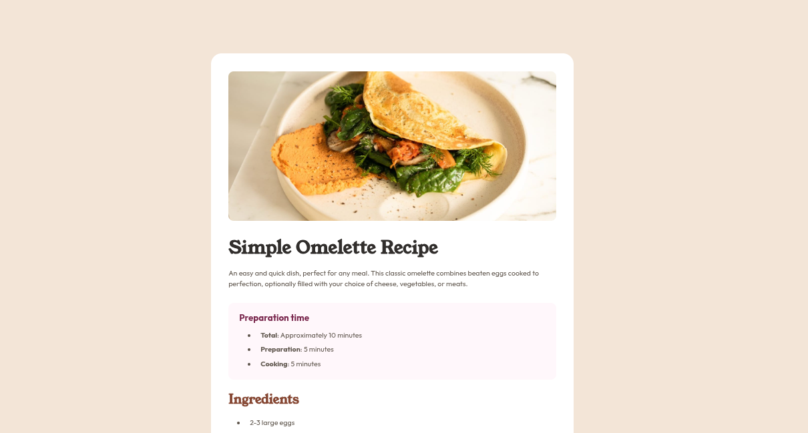

# Frontend Mentor - Recipe page solution

This is a solution to the [Recipe page challenge on Frontend Mentor](https://www.frontendmentor.io/challenges/recipe-page-KiTsR8QQKm). Frontend Mentor challenges help you improve your coding skills by building realistic projects.

## Table of contents

- [Overview](#overview)
  - [The challenge](#the-challenge)
  - [Screenshot](#screenshot)
  - [Links](#links)
- [My process](#my-process)
  - [Built with](#built-with)
  - [What I learned](#what-i-learned)
  - [Continued development](#continued-development)
  - [Useful resources](#useful-resources)
  - [AI Collaboration](#ai-collaboration)
- [Author](#author)
- [Acknowledgments](#acknowledgments)


## Overview

### Screenshot



### Links

- Solution URL: [https://github.com/vibesprint/recipe-page](https://github.com/vibesprint/recipe-page)
- Live Site URL: [https://vibesprint.github.io/recipe-page](https://vibesprint.github.io/recipe-page)

## My process

### Built with

- Semantic HTML5 markup
- Flexbox
- CSS pseudo-classes
- CSS pseudo-elements

### What I learned

What I learned new was CSS pseudo elements and pseudo classes. Styling the numbers of the list tag `<ol>` using the pseudo
element `li::marker` was new to me. Then for the table, it had to be styled using pseudo classes like `td:first-child`
to give borders only between rows and give spaces only between rows.

HTML structuring was a little difficult this time. It was a lot more sections and a lot of styles to different sections.
Also learned about the new semantic HTML elements like

```html
<section>
...
</section>
```

Similarly `<article>`, `<header>`, etc.

### Continued development

Styling is becoming difficult. Lots of repitition. I would like to look into more convenient ways of styling the html.

### Useful resources

- [https://www.w3schools.com/html/html5_semantic_elements.asp](https://www.w3schools.com/html/html5_semantic_elements.asp) - This is for the semantic HTML elements.
- [https://www.w3schools.com/css/css_table.asp](https://www.w3schools.com/css/css_table.asp) - This is for the CSS styling of the tables.
- [https://www.geeksforgeeks.org/css/css-tables/](https://www.geeksforgeeks.org/css/css-tables/) - Also for CSS table styling.

## Author

- Github - [vibesprint](https://github.com/vibesprint)
